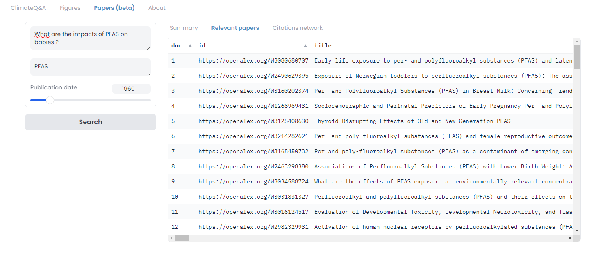

## Abstract

The latest version of ClimateQ&A introduces an exciting experimental feature that significantly expands its capability to provide up-to-date scientific knowledge. Responding to a high demand from its user base, ClimateQ&A now offers access to over 250 million scientific papers through integration with OpenAlex.org, alongside its existing repertoire of pre-recorded IPCC and IPBES reports. This enhancement is driven by the necessity to keep abreast of the latest scientific advancements and to cover a wider range of social and environmental topics not addressed in the standard IPCC and IPBES assessments. The feature, currently in beta, is accessible through the "Papers" tab, separate from the main chat interface, facilitating a direct and efficient exploration of current scientific literature.

## ClimateQ&A v1.4 now has access to 250 million research papers from OpenAlex.org
:::warning[Experimental]

This feature is still in the experimental phase and may undergo changes in the coming months.
In particular, now it's still super slow on the version deployed online.

:::

One of the most requested features for ClimateQ&A was the ability to access more scientific documents than the pre-recorded reports (IPCC, IPBES). This demand is driven by several reasons:
- To update the knowledge and identify knowledge gaps on the new scientific advances since the previous assessments.
- To access information on social/environmental topics not mentioned in the IPCC and IPBES reports.

During our work, we discovered [OpenAlex.org](https://openalex.org/), a platform that provides access to 250 million scientific papers, along with API access.

Therefore, version 1.4 of ClimateQ&A introduces an experimental feature for accessing OpenAlex.org in addition to the existing scientific documents.

For the time being, this feature is separate from the chat interface during the beta phase and is accessible under the **Papers** tab.

### Example 1 - What are the impacts of PFAS on babies?
For instance, let's explore the response to a question regarding "forever chemicals" (PFAS), a topic not addressed in the existing corpus (IPCC, IPBES). It's necessary to specify the question "What are the impacts of PFAS on babies?" along with keywords for searching on OpenAlex.org, here being "PFAS". It's also possible to set a minimum publication date (for instance, to only include recent publications).

Similar to the ClimateQ&A chat feature, we find in the **Summary** tab a synthesis of the information gleaned from the abstracts of the 15 most relevant papers to address the question.

In the **Relevant Papers** tab, a table of the 100 most pertinent publications is displayed, including all necessary information (title, abstract, DOI, URL, whether the paper is open access, etc.), with the publications sorted by relevance to the question.

Finally, the **Citations Network** tab shows a graph of the 100 publications connected by citations. In other words, an arrow indicates one paper citing another. This allows us to visually identify the most significant papers (the most cited) and the clusters that emerge to reveal different research themes. In this network, the size corresponds to the PageRank value of a node, meaning it's a measure of the paper's importance based on the number and quality of citations it receives. The more high-quality papers that cite a given paper, the higher its PageRank, indicating its influence and significance in the field. And the color indicates the paper's relevance to the question (with red being more relevant). This feature is directly inspired from https://www.connectedpapers.com/.

It's also very easy to follow the links to the referenced papers to directly open OpenAlex.org and continue the research.

### Example 2 - What are the impacts of deep sea mining?

Let's examine another question, "What are the impacts of deep sea mining?", a subject seldom mentioned in the IPBES reports. Applying a filter for publications after 2015, we clearly see the most significant publications at the center of the network.

## How it Works

A simplified operation is detailed in the schema below:

- From a user's question, a list of keywords is extracted using an LLM (Large Language Model). The user can also manually adjust the keywords. Since OpenAlex does not operate with semantic search, extracting a comprehensive set of relevant keywords is necessary to find papers likely to answer the question.
- We search for 100 relevant papers based on the keywords using OpenAlex.org's API.
- These papers are then sorted based on their relevance to the question (rather than to the keywords) using a cross-encoder model (also known as ReRanker, here we use [Mixed Bread AI's ReRank V1](https://www.mixedbread.ai/blog/mxbai-rerank-v1)).
- We select the 15 most relevant papers with the top reranking scores.
- A summarized response is synthesized from the abstracts of these 15 papers using an LLM and a prompt similar to that used in the chat.

## Next Steps

This is a new experimental feature, with many ideas for improvement:

- Currently, the model remains quite slow on CPU (about 30 seconds to answer a question), leaving ample room for optimization.
- After a testing phase, we will directly add OpenAlex.org as a documentary source in the Configuration tab to include the search (if relevant) additionally.
- It is also possible to delve deeper into citation networks to retrieve more relevant publications.
- It would be fantastic to link the scientific publications that contributed to the IPCC and IPBES assessments to provide updates to help scientists sift through the most relevant publications to update knowledge.

## Code

The open source code is available at https://huggingface.co/spaces/Ekimetrics/climate-question-answering/blob/main/climateqa/papers/openalex.py