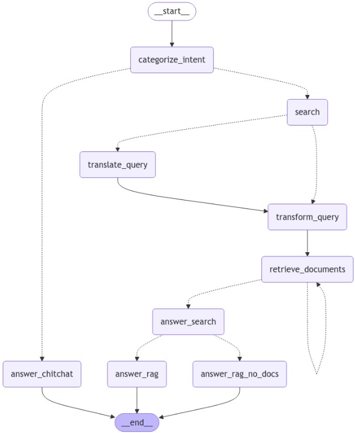
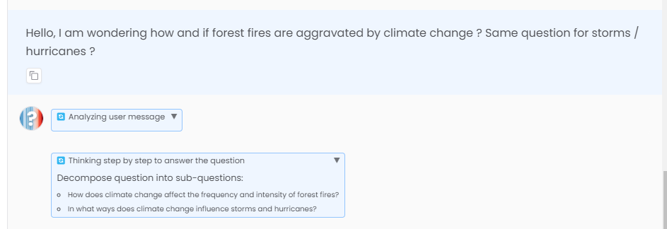
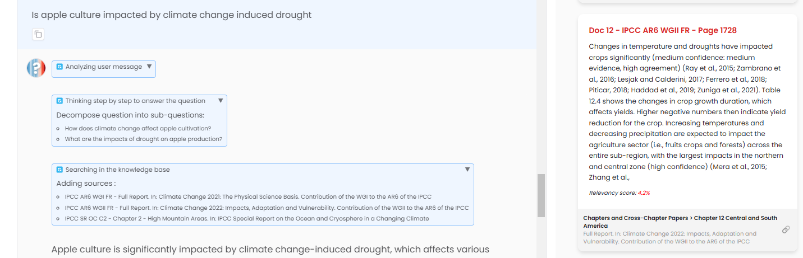

# v1.5.0 - 2024-10-28

## Introduction

After several months without updates, we are excited to announce the release of ClimateQ&A v1.5. This major release incorporates findings from our extensive R&D efforts and introduces significant technical improvements that enhance the tool's scalability and performance. The changes are primarily structural, laying the groundwork for more advanced features and improved user experience.

### Key Features

- **Major architectural improvements with agentic workflow**
    - Implemented langgraph framework for core operations
    - Added intent routing to better classify user queries
    - Introduced query decomposition for more efficient sub-question analysis
- **Performance enhancements -> the quality of answers should be overall really better** 
    - Migrated to gpt-4o-mini backend LLM for improved performance
    - Integrated Cohere reranker for superior result quality
- **Enhanced Visibility and Tracking**
    - Implemented confidence scoring system for source reliability
    - Added dedicated figures tab to distinguish between IPCC text and AI-generated figure descriptions
    - Upgraded to Gradio 5 with enhanced message formatting
    - Introduced step-by-step display in chat interface

## Focus: Agentic workflow

After analyzing tens of thousands of user queries since April 2023, we recognized that a one-size-fits-all pipeline couldn't effectively address the diverse range of questions. In response, we've completely restructured ClimateQ&A to operate using a decision graph (agentic) approach.
 

The new workflow follows a sophisticated decision tree:

1. **Query Processing**
    - Automatically translates non-English queries to English when necessary
    - Decomposes complex questions into smaller, more precise sub-queries for enhanced search accuracy
2. **Document Retrieval**
    - Performs targeted searches for each relevant sub-query
    - Applies re-ranking algorithms to assess document relevance
    - Retains only highly relevant documents that meet quality thresholds
3. **Response Generation**
    - Utilizes RAG (Retrieval-Augmented Generation) with qualified documents
    - Provides alternative responses when sufficient relevant documents aren't found
    - Includes additional quality control layers

The new graph-based architecture offers greater modularity in handling different types of queries. We've already identified several specialized use cases:

- Local climate change impacts
- Environmental impact of AI (beyond IPCC report coverage)
- Integration with additional scientific corpus databases like OpenAlex for expanded knowledge base

**Example with query processing and decomposition**

## Focus: sources confidence estimation

A key enhancement in this release is our implementation of advanced source reranking and confidence scoring. Each retrieved source now undergoes an evaluation process via reranking (for now using Cohere Reranking API), resulting in a confidence score that is transparently displayed to users. This feature serves two important purposes:

- Builds user trust by providing clear visibility into the reliability of our sources
- Helps users make informed judgments about the comprehensiveness and quality of each response

## Coming Soon: Version 1.6

Our next release, planned very soon in  the coming weeks, will showcase the platform's ability to incorporate supplementary content to enrich responses. Key improvements will include:

- **Scientific Publications**
    - Integration with OpenAlex API, providing access to 250 million scientific publications
    - Focus on recent research published since the latest IPCC reports
    - Addressing literature reviews and knowledge gaps with up-to-date scientific findings
- **Graphs**
    - Integration with trusted sources like Our World in Data