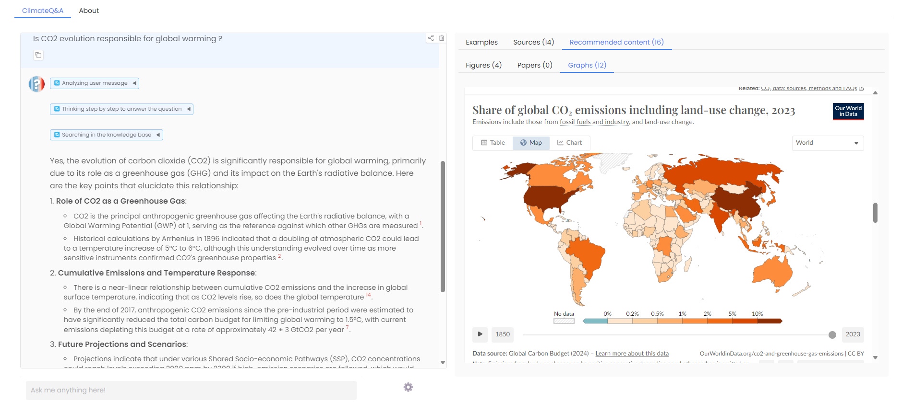
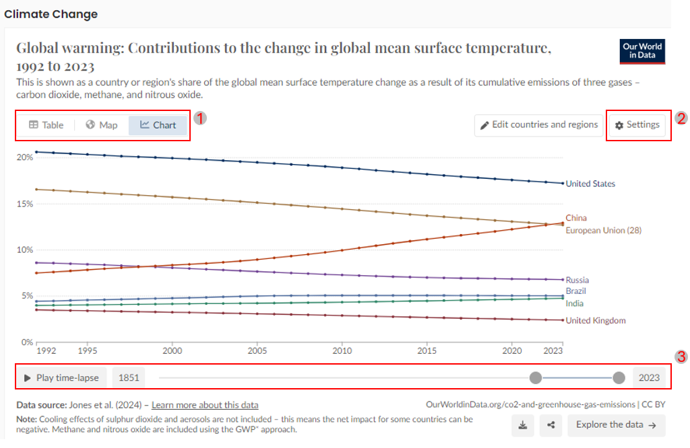
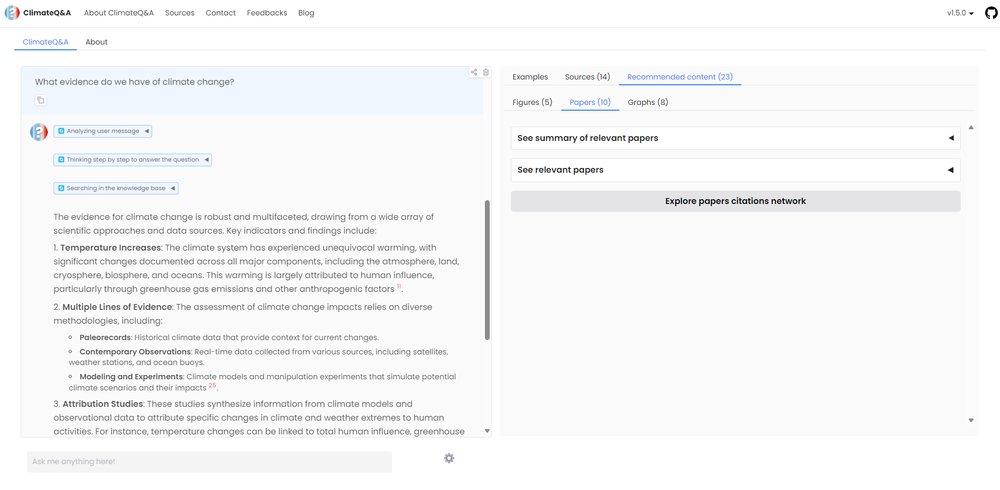
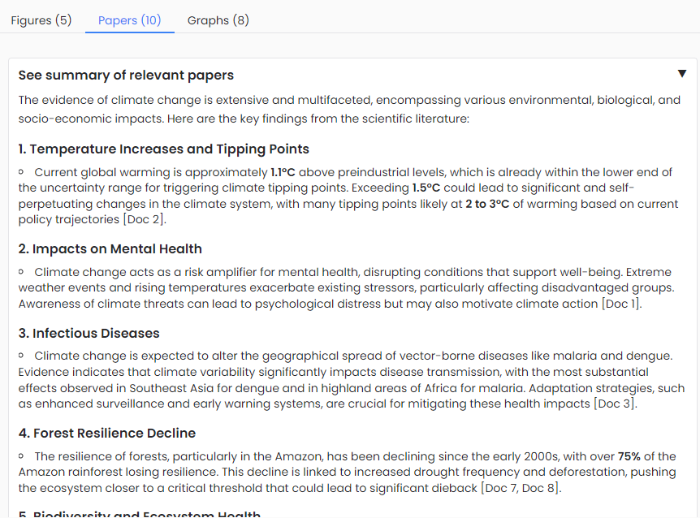
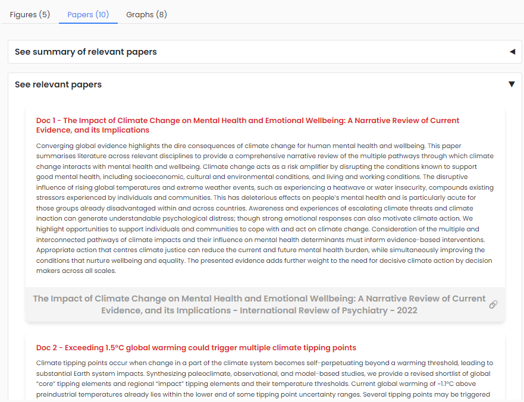
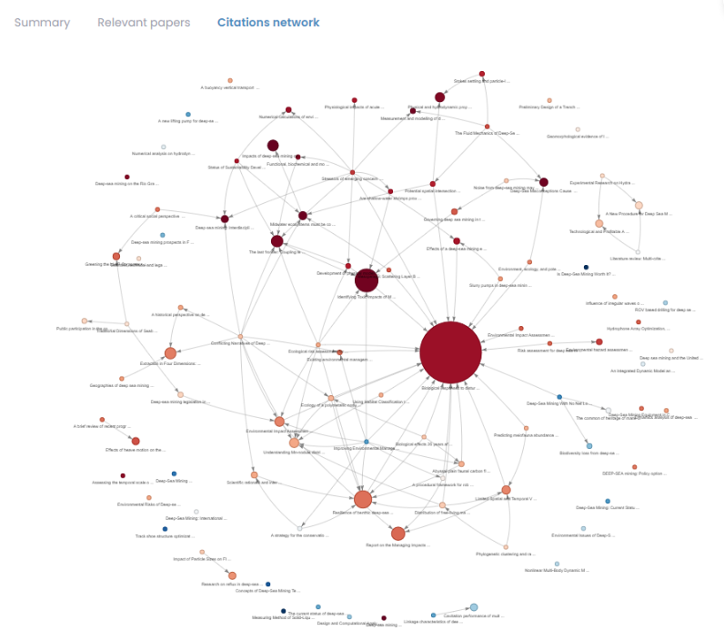
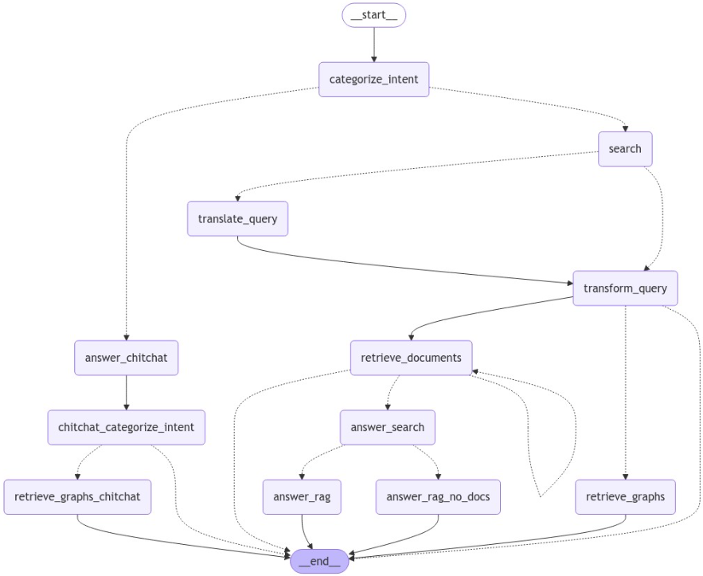

# v1.6.0 - 2023-12-18

## Introduction

This release focuses on expanding our knowledge sources and enhancing our search capabilities. 
We've introduced several key features that make climate research more intuitive and thorough.

### Key Features
- **Main Feature: Expanded Knowledge Sources**
    - Integrated **OpenAlex** API for scientific publication search
    - Added **Our World in Data** graph retrieval capabilities
- **Improved Source Prioritization**
    - Modified retriever to prioritize IPCC Summary for Policymakers
    - Ensures global, high-level insights before diving into technical details
    - Implemented parallel search mechanisms for documents and graphs
- **UI/UX Changes**
    - Added a "Recommended content" tab for elements that are not used by the chatbot
    - Added notification dynamic to highlight retrieved documents
    - Updated configuration panel and added standalone search mode

## Focus: Our World in Data - Visual Insights

Our World in Data integration brings comprehensive climate visualizations directly into ClimateQ&A, transforming how users understand global climate trends.
 
- **Visualization Capabilities**
    - Access to hundreds of peer-reviewed, meticulously sourced graphics
    - Interactive graphical interface to explore data

**Interactive interface**

1. **View Options (Chart, Map, Table)** 
The graphic allows you to switch between different views: Chart, Map, and Table. These options are located at the top left corner (marked as 1 in the image).

- **Chart**: Displays the data as a line graph, showing the trend over time.
- **Map**: Provides a geographical representation of the data.
- **Table**: Presents the data in a tabular format for detailed numerical information.

2. **Settings and Customization**
    - You can customize display and select countries to compare.
3. **Time-lapse and Year Selection**
    - You can select a specific year using the slider or by entering the year in the input box. This helps in comparing data for different years directly.

**Visualization Categories**
Our World in Data provides a wide range of visualizations covering various climate-related topics:
- Air Pollution
- Biodiversity
- CO2 & Greenhouse Gas Emissions
- Climate Change
- Energy
- Environmental Impacts of Food Production
- Environmental Protection & Regulation
- Fertilizers
- Forests & Deforestation
- Fossil Fuels
- Land Use
- Meat & Dairy Production
- Plastic Pollution
- Transport
- Waste Management
- Water Pollution

## Focus: OpenAlex - Scientific Publication Integration

Introducing open papers document search from user queries. See more details here: https://climateqa.com/blog/openalex

**Interface Walkthrough**

Relevant papers are displayed in the relevant content tab with 3 different views:
1. **Papers summary view**
2. **Papers list view**
3. **Citation network view**

1. **Papers summary view**
Provides a summary of the relevant papers retrieved from the query.

2. **Papers list view**
Provides a list of the relevant papers retrieved from the query.

3. **Citation network view**
Provides a citation network of the relevant papers retrieved from the query.

## Focus Workflow update 

The workflow has been updated to retrieve simultanously documents and OWID graphs.
Papers search is currently handled in a separate workflow with gradio

## Coming next: Version 1.7

Our next release will focus on accessing granular data to answer local concerns.
