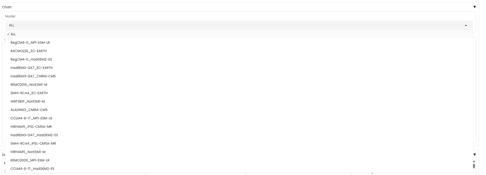

# v1.7.0 - 2025-04-08

## Introduction

This release focuses on making climate data more accessible and interactive through localized insights and dynamic conversations. We've introduced several key features that make climate information more personalized and actionable.

### Main features:

- **Dynamic conversation**:
    - ClimateQA now uses chat history to understand questions in context
    - Suggests follow-up questions to explore topics further
- **Local QA**:
    - Ask questions about impact of, and adaptation to, climate change
    - Two regions covered: Ville de Paris (France) and Region Nouvelle Aquitaine (France)
- **Talk To Drias**:
    - Interactive queries about DRIAS TRACC (Trajectoire de réchauffement de référence pour l'adaptation au changement climatique)
    - Visualize localized climate data results
    
## Focus: Dynamic Conversation

The new conversation system transforms how users interact with climate data through two major improvements: context-aware questioning and intelligent follow-up suggestions.

### 1. Context-Aware Questioning

ClimateQA now maintains conversation context by:
- Processing the previous message to understand the current context
- Creating standalone questions that incorporate previous context
- Maintaining topic continuity across multiple exchanges

Example interaction:
```plaintext
User: "What are the climate risks in Paris?"
System: [Provides information about Paris climate risks]
User: "And what about adaptation measures?"
System: [Internally converts to "What are the adaptation measures for climate risks in Paris?"]
```

### 2. Smart Follow-up Suggestions

The system now actively guides users to deeper understanding through:
- Automatically generated follow-up questions based on current topic
- Suggestions that explore different aspects of the discussed subject
- Progressive learning path recommendations

Example suggestions flow:
```plaintext
User: "How will climate change affect agriculture in Nouvelle Aquitaine?"
System: [Provides initial answer]
Suggested follow-ups:
1. "What crops are most vulnerable to these changes?"
2. "What adaptation strategies are recommended for farmers?"
3. "How do these impacts compare to other French regions?"
```


## Focus: Local QA

The Local QA feature revolutionizes how users access local climate information through detailed, region-specific data from authoritative sources. We've focused on two experimental regions in France, providing deeper insights through comprehensive local climate documentation.


### Data Sources

1. **Ville de Paris**
   - Plan Climat-Air-Energie Territorial (PCAET)
   - Plan Biodiversité de Paris

2. **Region Nouvelle Aquitaine**
   - Acclimaterra, le GREC (Groupe Régional d'Expertise sur le changement Climatique)


### Key Use Cases

1. **Local Impact Understanding**
   - Personalized climate change effects
   - Region-specific risk assessment
   - Sector-specific impacts

2. **Adaptation Planning**
   - Current adaptation measures
   - Future adaptation strategies
   - Policy and implementation timelines

3. **Strategy Development**
   - Local adaptation strategy building
   - Community-level planning
   - Individual action recommendations

### Global to Local Climate Insights

The Local QA feature bridges the gap between global climate science and local realities by contextualizing IPCC projections with regional expertise. By combining the comprehensive climate scenarios from the IPCC with detailed local studies, we provide a more nuanced understanding of climate change impacts. This approach allows us to ground global projections in local realities, translating broad climate trends into specific regional effects. The integration of local expertise from sources like PCAET, Plan Biodiversité, and Acclimaterra enriches the global models with concrete examples and region-specific observations. This synthesis of global and local knowledge enables more precise risk assessments and helps develop targeted adaptation strategies that are both scientifically sound and practically implementable at the local level.


### Region-Specific Analysis

1. **Ville de Paris**
   - Urban heat island effects
   - Flood risk assessment
   - Adaptation strategies from PCAET
   - Biodiversity protection measures

2. **Region Nouvelle Aquitaine**
   - Rising temperatures
   - More frequent and intense summer droughts
   - Forests at risk, needing species adaptation and renewal
   - Coastal areas threatened by sea level rise and erosion
   - Mountain tourism vulnerable due to reduced snowfall


## Focus: Talk To Drias

Talk to Drias provides precise and global insights into French climate data through simple visualizations, giving users a more quantitative view of local climate trends.

### Interface Walkthrough


1. **Direct Question Input Field**
   Users can query any of the following DRIAS TRACC indicators:
    - Total winter precipitation
    - Total summer precipitation
    - Total annual precipitation
    - Total remarkable daily precipitation
    - Frequency of remarkable daily precipitation
    - Extreme precipitation intensity
    - Mean winter temperature
    - Mean summer temperature
    - Mean annual temperature
    - Maximum summer temperature
    - Number of days with TX above 30°C
    - Number of days with TX above 35°C
    - Number of days with a dry ground


2. **Relevant Tables Selection**
   - Up to 3 most relevant indicators are automatically selected
   - Click-to-switch functionality between indicators
   - Real-time data updates

3. **SQL Query Visualization**
   - Transparent display of the underlying query
   - Helps users understand data retrieval logic

4. **Dynamic Charting**
   Four visualization types available:
   - Line plots: Temporal evolution of indicators
   - Bar charts: Annual frequency distribution
   - Histograms: Cross-location distribution
   - Choropleth maps: Spatial distribution across France

5. **Model Filtering System**
   - Filter by RCM-GCM combinations
   - Compare different climate model predictions
   - Real-time visualization updates




6. **Data Explorer**
   - Raw data access through interactive tables
   - Export functionality
   - Navigation between related indicators


## Technical Updates
1. **Backend Improvements**
   - Implemented context-aware questioning system that maintains conversation history
   - Added intelligent follow-up question generation
   - Enhanced query processing for local and global climate data retrieval

2. **Frontend Enhancements**
   - Added dynamic visualization components for DRIAS climate data
   - Implemented interactive tables for data exploration
   
3. **Data Updates**
   - Integrated local climate data sources for Paris and Nouvelle Aquitaine regions
   - Added DRIAS TRACC data integration with multiple visualization types

## Workflow Updates

The workflow has been significantly enhanced to handle both global and local climate questions through specialized processing pipelines:

1. **Global QA Pipeline**


2. **Local QA Pipeline**


These parallel pipelines enable more precise and contextually relevant responses while maintaining the dynamic conversation capabilities introduced in this release.

## Coming Next: Version 1.8

Our next release will focus on:
- Expanding local coverage
- Enhanced dynamic visualization capabilities


[Future version details to be announced]