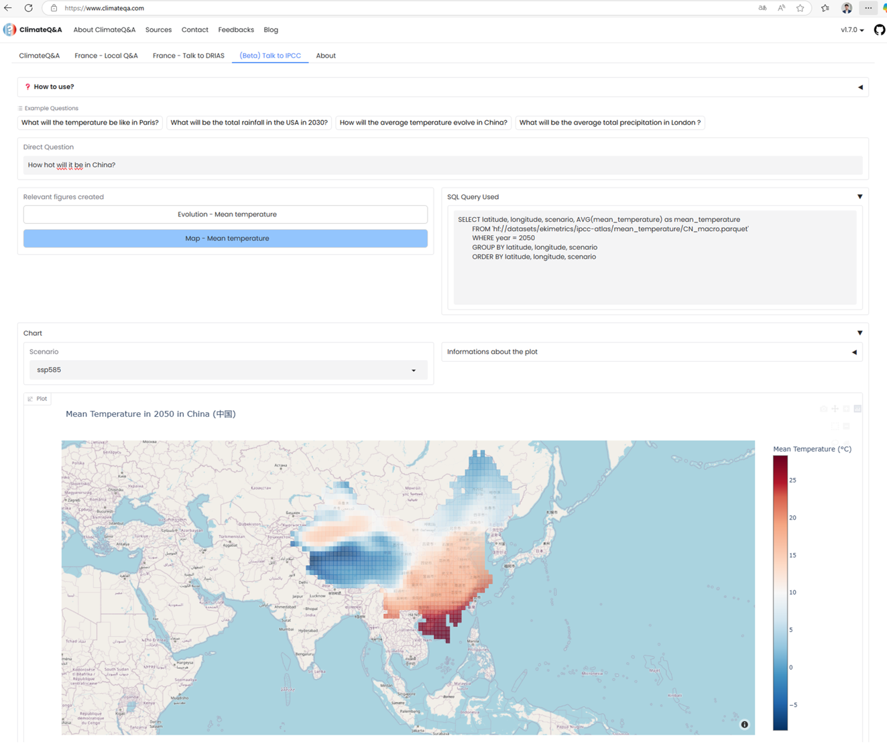

# v1.8.0 - 2025-06-09

## Introduction

This release introduces a groundbreaking new feature that brings IPCC climate data directly to users through interactive visualizations and natural language queries. Building on the success of Talk to Drias, we now provide access to the comprehensive IPCC Atlas dataset, enabling users to explore global climate projections with unprecedented ease.

### Main features:

- **Talk to IPCC**:
    - Interactive queries about IPCC Atlas climate data
    - Global coverage with temperature and precipitation indicators
    - Dynamic visualizations including time series and spatial maps
    - Support for historical data and future climate scenarios (SSP126, SSP245, SSP370, SSP585)
- **Enhanced data infrastructure**:
    - Integration with IPCC Atlas dataset via Hugging Face
    - Optimized query processing for large-scale climate data
    - Parallel processing for improved performance

## Focus: Talk to IPCC

The new Talk to IPCC feature revolutionizes access to global climate data by providing an intuitive interface to explore IPCC Atlas projections. This feature enables users to query comprehensive climate datasets covering temperature and precipitation indicators worldwide, with both historical records and future projections under different climate scenarios.

### Data Sources

**IPCC Atlas Dataset (CMIP6)**
- Comprehensive global climate projections from the IPCC-WGI AR6 Interactive Atlas
- Historical data from 1850 onwards and future projections up to 2100
- Multiple climate model realizations for ensemble-based uncertainty estimation
- Four SSP projection scenarios: SSP1-2.6, SSP2-4.5, SSP3-7.0, SSP5-8.5
- High-resolution spatial coverage with 1°×1° global grid precision

*For detailed technical specifications, see [Talk to IPCC Technical Documentation](../../tutorial-extras/talk-to-ipcc-technical.md)*

### Key Indicators Available

**Currently Supported:**
1. **Mean Temperature** - Historical and projected temperature data (°C)
2. **Total Precipitation** - Rainfall and precipitation patterns (mm/day)

**Future Expansion:**
The underlying IPCC Atlas dataset includes 22 comprehensive climate indicators across heat/cold, precipitation/drought, wind, snow/ice, and ocean conditions, which will be integrated in future releases.

*For complete indicator specifications, see [Talk to IPCC Technical Documentation](../../tutorial-extras/talk-to-ipcc-technical.md)*

### Visualization Types

1. **Temporal Evolution Charts**
   - Line plots showing indicator evolution over time
   - Historical data combined with future projections
   - Multiple scenario comparison (SSP126, SSP245, SSP370, SSP585)
   - Location-specific time series analysis

2. **Spatial Distribution Maps**
   - Choropleth maps showing indicator distribution
   - Country and region-level spatial analysis
   - Year-specific snapshots
   - Interactive scenario filtering

### Interface Features

1. **Natural Language Queries**
   - Direct question input with examples provided
   - Support for location and time-specific queries
   - Intelligent parameter extraction from user questions

2. **Dynamic Results Display**
   - Multiple relevant visualizations per query
   - SQL query transparency for data verification
   - Interactive scenario filtering
   - Raw data access through expandable tables

### Query Capabilities

**Supported Query Types:**
- "What will the temperature be like in Paris?"
- "What will be the total rainfall in the USA in 2030?"
- "How will the average temperature evolve in China?"
- "What will be the average total precipitation in London?"

**Parameters Supported:**
- **Location**: Countries, cities, and regions worldwide
- **Year**: Any year from 1850 to 2100
- **Indicator**: Mean temperature or total precipitation
- **Scenario**: Historical data and SSP projections

### Technical Implementation

1. **Data Processing Pipeline**
   - Intelligent parameter extraction using LLM-powered analysis
   - Parallel SQL query execution for multiple visualizations
   - Optimized data aggregation with three-tier country classification system

2. **Visualization Engine**
   - Dynamic chart generation using Plotly
   - Responsive choropleth maps with OpenStreetMap integration
   - Interactive scenario filtering and comparison capabilities

3. **Performance Optimizations**
   - Intelligent query routing based on country size and data complexity
   - Multi-level statistical aggregation for robustness
   - Asynchronous processing for multiple visualizations

*For detailed technical architecture, see [Talk to IPCC Technical Documentation](../../tutorial-extras/talk-to-ipcc-technical.md)*

## Technical

1. **Backend Enhancements**
   - New IPCC workflow engine for processing climate data queries
   - Integration with Hugging Face datasets for seamless data access
   - Parallel processing implementation for multiple visualization generation
   - Enhanced SQL query builder with location and temporal parameter support

2. **Frontend Improvements**
   - New Talk to IPCC tab with comprehensive user interface
   - Interactive scenario selection and filtering
   - Dynamic visualization switching between multiple results
   - Enhanced example system with visual previews

3. **Data Infrastructure**
   - IPCC Atlas dataset integration via `hf://datasets/ekimetrics/ipcc-atlas`

## How Talk to IPCC Works

The Talk to IPCC feature follows a sophisticated multi-step workflow to transform natural language questions into interactive climate visualizations:

### Step 1: Question Understanding
When a user asks a question like "What will the temperature be like in Paris in 2050?", the system uses large language models to extract key parameters:
- **Location**: Paris (converted to coordinates: 48.5°N, 2.5°E)
- **Indicator**: Temperature (mapped to mean_temperature dataset)
- **Time**: 2050 (used for data filtering)
- **Intent**: Spatial distribution vs. temporal evolution

### Step 2: Intelligent Data Routing
Based on the extracted parameters, the system determines the optimal data access strategy:
- **Country Classification**: France is classified as a "regular country"
- **Dataset Selection**: Routes to `mean_temperature/FR.parquet`
- **Query Strategy**: Real-time aggregation (monthly median to annual average)

### Step 3: Parallel Visualization Generation
The system generates multiple relevant visualizations simultaneously:
- **Evolution Plot**: Shows temperature trends over time (1850-2100) with historical data and SSP scenarios
- **Choropleth Map**: Displays spatial temperature distribution across France for 2050
- **Data Tables**: Provides raw data access for transparency

### Step 4: Interactive Results Presentation
Users receive a comprehensive response with:
- **Multiple Visualizations**: Can switch between different chart types
- **Scenario Filtering**: Interactive dropdown to compare SSP1-2.6, SSP2-4.5, SSP3-7.0, SSP5-8.5
- **SQL Transparency**: Shows the actual queries used to retrieve data
- **Export Options**: Access to underlying data for further analysis

This workflow enables users to go from a simple question to comprehensive climate insights in seconds, with full transparency about the data sources and processing methods used.

## Limitations and Considerations

**Current Limitations:**
- Limited to temperature and precipitation indicators
- Single location queries (no multi-location comparison)
- Data availability constrained to 1850-2100 timeframe
- No direct climate model comparison capabilities

**Data Logging:**
- User queries are logged for meta-analysis purposes
- Users advised to avoid sharing sensitive information
- Logging helps improve system performance and accuracy

## Dataset Coverage

The IPCC Atlas dataset includes 22 comprehensive climate indicators across multiple categories, with current Talk to IPCC support for temperature and precipitation indicators. Future releases will expand coverage to include extreme weather events, ocean conditions, and additional environmental parameters.

*For complete indicator specifications and technical details, see [Talk to IPCC Technical Documentation](../../tutorial-extras/talk-to-ipcc-technical.md)*
