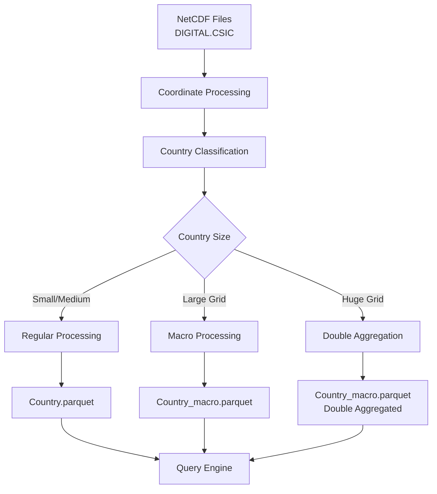

# Talk to IPCC - Technical Documentation

This page provides comprehensive technical documentation for the Talk to IPCC feature, including data processing pipelines, storage optimization strategies, and query mechanisms.

## Overview

Talk to IPCC provides interactive access to the IPCC-WGI AR6 Interactive Atlas Dataset (CMIP6), enabling users to query global climate projections through natural language interfaces. The system transforms raw NetCDF climate data into an optimized, queryable format supporting real-time visualization generation.

## Data Sources and Structure

### Source Dataset
- **Origin**: IPCC-WGI AR6 Interactive Atlas Dataset hosted on DIGITAL.CSIC
- **Format**: NetCDF files with 1°×1° spatial resolution
- **Coverage**: 180 × 360 grid points globally (64,800 total grid points)
- **Coordinates**: Longitudes from -179.5° to 179.5°, latitudes from -89.5° to 89.5°
- **Temporal Range**: 
  - Historical: 1850-2015
  - Projections: 2016-2100
- **Scenarios**: Historical + 4 SSP scenarios (SSP1-2.6, SSP2-4.5, SSP3-7.0, SSP5-8.5)
- **Realizations**: Multiple climate model outputs per scenario for ensemble analysis

### Climate Indicators Available

The dataset includes 22 comprehensive climate indicators across multiple categories:

#### Heat and Cold Indicators
| Code | Name | Unit | Description |
|------|------|------|-------------|
| `t` | Monthly mean temperature | °C | Monthly mean of daily mean temperature |
| `tn` | Monthly minimum temperature | °C | Monthly mean of daily minimum temperature |
| `tx` | Monthly maximum temperature | °C | Monthly mean of daily maximum temperature |
| `tnn` | Temperature minimum extreme | °C | Monthly minimum of daily minimum temperature |
| `txx` | Temperature maximum extreme | °C | Monthly maximum of daily maximum temperature |
| `tx35` | Hot days | days | Monthly count of days with maximum temperature above 35°C |
| `tx40` | Very hot days | days | Monthly count of days with maximum temperature above 40°C |
| `tx35ba` | Hot days (bias-adjusted) | days | Monthly bias adjusted TX35 |
| `tx40ba` | Very hot days (bias-adjusted) | days | Monthly bias adjusted TX40 |
| `cd` | Cooling degree days | days | Annual cooling degree days |
| `hd` | Heating degree days | °C days | Annual heating degree days |
| `fd` | Frost days | days | Monthly frost days |

#### Precipitation and Drought Indicators
| Code | Name | Unit | Description |
|------|------|------|-------------|
| `pr` | Total precipitation | mm/day | Monthly mean of daily total precipitation |
| `rx1day` | Maximum 1-day precipitation | mm | Monthly maximum of 1-day accumulated precipitation |
| `rx5day` | Maximum 5-day precipitation | mm | Monthly maximum of 5-day accumulated precipitation |
| `cdd` | Consecutive dry days | days | Annual consecutive dry days |
| `spi6` | Standardized Precipitation Index | 1 | SPI for 6 months cumulation period |

#### Environmental Conditions
| Code | Name | Unit | Description |
|------|------|------|-------------|
| `sfcwind` | Wind speed | m/s | Monthly mean of daily mean wind speed |
| `prsn` | Snowfall | mm/day | Monthly mean of accumulated snowfall precipitation |
| `siconc` | Sea ice concentration | % | Monthly mean of sea-ice area percentage |
| `sst` | Sea surface temperature | °C | Monthly mean of sea surface temperature |
| `ph` | Ocean pH | pH | Monthly mean of pH at surface |

**Note**: Currently, Talk to IPCC supports only `t` (mean temperature) and `pr` (total precipitation). Additional indicators will be integrated in future releases.

## Data Processing Pipeline

### 1. Data Transformation Architecture

The system implements a sophisticated pipeline to transform raw NetCDF files into optimized Parquet format:



### 2. Coordinate System Integration

**Coordinates Table Creation:**
- Global 1°×1° grid extraction from NetCDF files
- Reverse geocoding using `reverse_geocoder.search()` for location mapping
- ISO alpha-2 country codes via `pycountry` library
- Administrative region (admin1) identification

**Schema:**
```sql
CREATE TABLE coordinates (
    latitude FLOAT64,
    longitude FLOAT64,
    country_code STRING,  -- ISO alpha-2
    admin1 STRING,        -- Region/state/province
    country_name STRING
);
```

### 3. Performance-Optimized Storage Strategy

The system uses a three-tier optimization approach based on country grid size:

#### Tier 1: Regular Countries
- **Storage**: Single Parquet file per country per indicator
- **File naming**: `{indicator}/{country_code}.parquet` (e.g., `mean_temperature/FR.parquet`)
- **Processing**: Real-time aggregation during query execution

#### Tier 2: Macro Countries (19 countries)
Countries with large grid coverage requiring pre-aggregation for performance:

| Country Code | Country Name |
|--------------|--------------|
| JP | Japan |
| IN | India |
| MH | Marshall Islands |
| PT | Portugal |
| ID | Indonesia |
| SJ | Svalbard and Jan Mayen |
| MX | Mexico |
| CN | China |
| GL | Greenland |
| PN | Pitcairn |
| AR | Argentina |
| AQ | Antarctica |
| PF | French Polynesia |
| BR | Brazil |
| SH | Saint Helena, Ascension and Tristan da Cunha |
| GS | South Georgia and the South Sandwich Islands |
| ZA | South Africa |
| NZ | New Zealand |
| TF | French Southern Territories |

- **Storage**: Both raw and pre-aggregated files
- **Pre-aggregation SQL**:
```sql
SELECT latitude, longitude, scenario, year, month, 
       MEDIAN({indicator}) AS {indicator}, 
       country_code, country_name
FROM 'hf://datasets/ekimetrics/ipcc-atlas/{indicator}/{country_code}.parquet'
GROUP BY latitude, longitude, scenario, year, month, country_code, country_name
```

#### Tier 3: Huge Macro Countries (5 countries)
Countries requiring double aggregation for optimal performance:

| Country Code | Country Name |
|--------------|--------------|
| CL | Chile |
| CA | Canada |
| AU | Australia |
| US | United States |
| RU | Russia |

- **Double aggregation SQL**:
```sql
WITH medians_per_month AS (
    SELECT latitude, longitude, year, scenario, month, 
           MEDIAN({indicator}) AS median_value
    FROM 'hf://datasets/ekimetrics/ipcc-atlas/{indicator}/{country_code}.parquet'
    GROUP BY latitude, longitude, scenario, year, month
)
SELECT latitude, longitude, year, scenario, 
       AVG(median_value) AS {indicator}
FROM medians_per_month
GROUP BY latitude, longitude, scenario, year
ORDER BY latitude, longitude, year, scenario
```

### 4. Data Schema

**Indicator Tables Schema:**
```sql
CREATE TABLE {indicator_table} (
    latitude FLOAT32,
    longitude FLOAT32,
    year INT,
    month INT,
    realization STRING,      -- Climate model identifier
    {indicator} FLOAT32,     -- Indicator value
    projection STRING,       -- Always 'CMIP6'
    scenario STRING,         -- 'historical' or SSP scenario
    country_code STRING,
    country_name STRING
);
```

## Query Processing System

### 1. Visualization Types and Queries

#### Evolution Plot
Shows temporal evolution of indicators at specific locations with historical data and future projections.

**Regular Countries Query Example** (Paris, France):
```sql
WITH medians_per_month AS (
    SELECT year, scenario, month, MEDIAN(mean_temperature) AS median_value
    FROM 'hf://datasets/ekimetrics/ipcc-atlas/mean_temperature/FR.parquet'
    WHERE latitude = 48.5 AND longitude = 2.5 AND year >= 1950
    GROUP BY scenario, year, month
)
SELECT year, scenario, AVG(median_value) AS mean_temperature
FROM medians_per_month
GROUP BY scenario, year
ORDER BY year, scenario
```

**Macro Countries Query Example** (Shanghai, China):
```sql
SELECT year, scenario, AVG(mean_temperature) as mean_temperature
FROM 'hf://datasets/ekimetrics/ipcc-atlas/mean_temperature/CN_macro.parquet'
WHERE latitude = 31.5 AND longitude = 121.5 AND year >= 1950
GROUP BY scenario, year
ORDER BY year, scenario
```

**Huge Macro Countries Query Example** (New York, USA):
```sql
SELECT year, scenario, mean_temperature
FROM 'hf://datasets/ekimetrics/ipcc-atlas/mean_temperature/US_macro.parquet'
WHERE latitude = 40.5 AND longitude = -74.5 AND year >= 1950
ORDER BY year, scenario
```

#### Choropleth Map
Displays spatial distribution of indicators across countries for specific years.

**Regular Countries Query Example** (France, 2050):
```sql
WITH medians_per_month AS (
    SELECT latitude, longitude, scenario, month, 
           MEDIAN(mean_temperature) AS median_value
    FROM 'hf://datasets/ekimetrics/ipcc-atlas/mean_temperature/FR.parquet'
    WHERE year = 2050
    GROUP BY latitude, longitude, scenario, month
)
SELECT latitude, longitude, scenario, AVG(median_value) AS mean_temperature
FROM medians_per_month
GROUP BY latitude, longitude, scenario
ORDER BY latitude, longitude, scenario
```

### 2. Query Optimization Strategy

#### Intelligent Routing
The system automatically selects the appropriate query strategy based on:
- Country classification (Regular/Macro/Huge Macro)
- Available pre-aggregated data
- Query complexity and expected performance

#### Statistical Aggregation Methods
1. **Ensemble Handling**: Median computation across climate model realizations for statistical robustness
2. **Temporal Aggregation**: Monthly medians averaged to annual values for consistency
3. **Spatial Consistency**: Grid-point level precision maintained throughout processing
4. **Scenario Preservation**: All SSP scenarios processed independently to maintain projection integrity

## Technical Implementation

### 1. Backend Architecture

**Core Components:**
- **Workflow Engine**: `ipcc_workflow()` orchestrates query processing
- **Parameter Extraction**: LLM-powered analysis of natural language queries
- **SQL Generation**: Dynamic query building based on country tier and visualization type
- **Parallel Processing**: Asynchronous execution of multiple visualizations

**Key Files:**
- `climateqa/engine/talk_to_data/workflow/ipcc.py` - Main workflow orchestration
- `climateqa/engine/talk_to_data/ipcc/queries.py` - SQL query generation
- `climateqa/engine/talk_to_data/ipcc/plots.py` - Visualization functions
- `climateqa/engine/talk_to_data/ipcc/config.py` - Configuration and constants

### 2. Performance Optimizations

**Storage Optimizations:**
- Zstandard (zstd) compression for Parquet files
- Country-based partitioning for efficient filtering
- Pre-computed aggregations for large countries

**Query Optimizations:**
- Adaptive SQL generation based on data availability
- Parallel execution of multiple visualization queries
- Efficient memory management for large datasets
- Connection pooling for database access

**Caching Strategy:**
- Query result caching for repeated requests
- Intermediate result storage for complex aggregations
- Metadata caching for faster parameter extraction

### 3. Error Handling and Validation

**Data Validation:**
- Coordinate bounds checking (-90 to 90 latitude, -180 to 180 longitude)
- Year range validation (1850-2100)
- Country code verification against available datasets
- Scenario validation against supported SSP scenarios

**Error Recovery:**
- Graceful degradation when data is unavailable
- Alternative query strategies for performance issues
- User-friendly error messages for invalid requests
- Logging and monitoring for system health

## API Reference

### Main Functions

#### `ask_ipcc(query: str, index_state: int = 0, user_id: str | None = None)`
Main entry point for IPCC data queries.

**Parameters:**
- `query`: Natural language question about climate data
- `index_state`: Index of result to return (for pagination)
- `user_id`: User identifier for logging purposes

**Returns:**
```python
tuple[
    str,           # SQL query used
    pd.DataFrame,  # Resulting data
    Callable,      # Figure generation function
    str,           # Plot information
    list,          # All SQL queries
    list,          # All dataframes
    list,          # All figure functions
    list,          # All plot information
    int,           # Current index
    list,          # Table names
    str            # Error message (if any)
]
```

#### `ipcc_workflow(user_input: str)`
Core workflow processing function.

**Parameters:**
- `user_input`: User's natural language query

**Returns:**
```python
State = {
    'user_input': str,
    'plots': list,
    'outputs': dict,
    'error': str
}
```

### Configuration Constants

**Available Scenarios:**
```python
IPCC_SCENARIO = [
    "historical",
    "ssp126", 
    "ssp245",
    "ssp370", 
    "ssp585"
]
```

**Supported Indicators:**
```python
IPCC_TABLES = [
    "mean_temperature",
    "total_precipitation"
]
```

**Plot Parameters:**
```python
IPCC_PLOT_PARAMETERS = [
    'year',
    'location'
]
```
